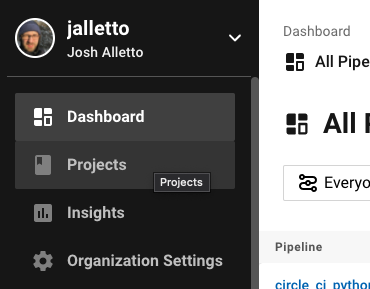
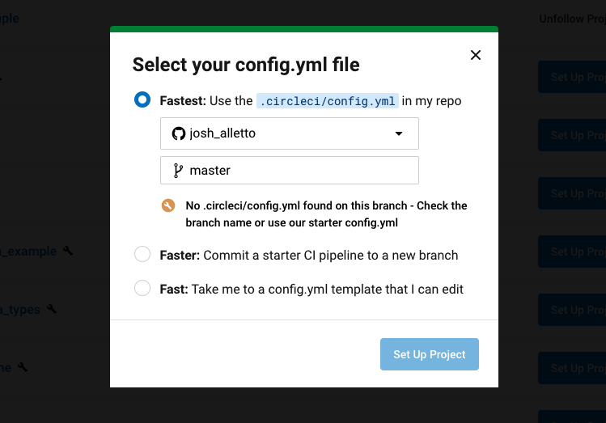
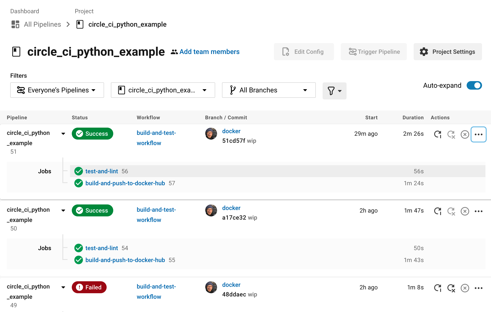
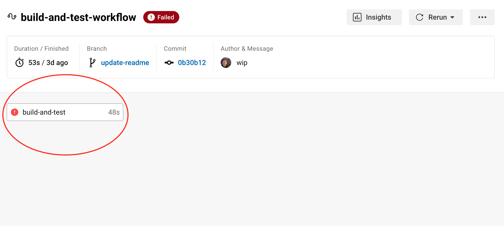
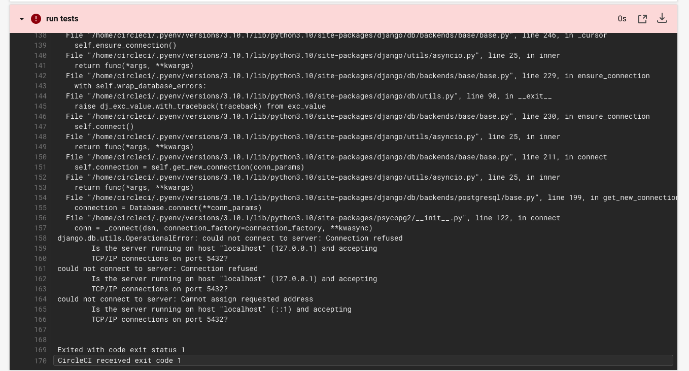
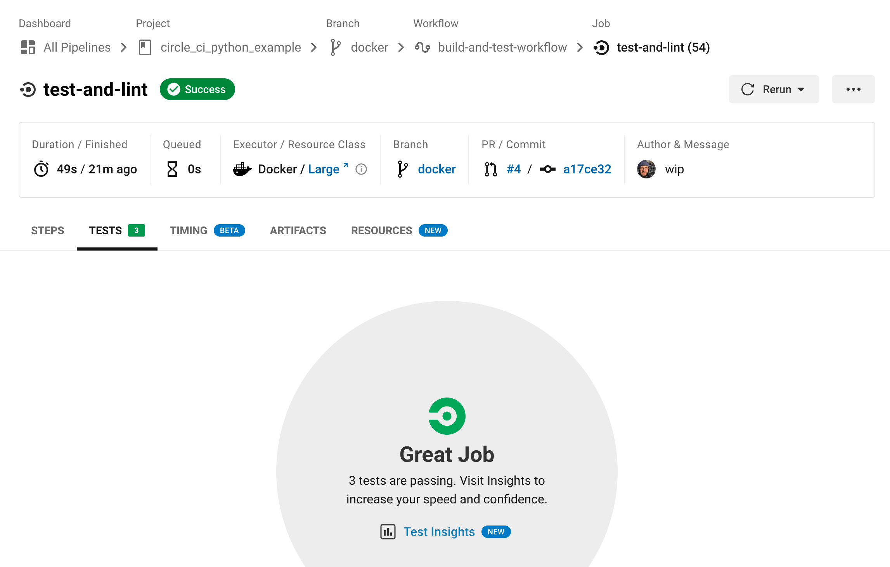

**This article explains how to deploy Django applications using CircleCI. Earthly significantly enhances build speeds with its advanced caching mechanisms. [Check it out](https://cloud.earthly.dev/login).**

I'm currently working on a project comparing different CI/CD pipelines, trying to get a better idea of what each offers, how they run, and how much it takes to get them set up. My first stop was CircleCi.

If you're looking for a reliable CI/CD platform to deploy your Python Django project, CircleCi offers a lot. It's easy to set up, comes with tons of reusable setups called Orbs, and best of all, offers up to 6,000 build minutes per month for free.

## What We're Building

To get familiar with CircleCi I spun up a small [sample DJango project](https://github.com/jalletto/circle_ci_python_example) to use for this tutorial. I am ~~a compulsive hoarder~~ an avid collector of movies. The idea behind the Django project is an app to help me keep track of all of my blu-rays, DVDs, etc, but really it is just an example project to have something to work with in CircleCi.

In this tutorial we'll learn how to have CircleCi run our linter. Then we'll run our tests and save the data. Lastly we'll build a Docker image and push it to Docker Hub.

<div class="notice--info">

### A Note About Physical Media Inventory Managers

As I'm sure you've already guessed there are dozens of apps that do this very well already, but I am required by tutorial writers law to choose something that already exists and build a worse version of it. My hands are tied.

If you want a great app for keeping track of your Blu-ray collection checkout [MovieBuddy](https://apps.apple.com/us/app/moviebuddy-movie-tv-library/id965645508).

If you want to learn more about how to build and test Django apps with CircleCi, read on.
</div>

## CircleCi: Getting Started

One thing I really like about CircleCi is that it has a completely free tier and so it's is easy to sign up and get started without having to enter any credit card information. Other products I've tried offer a month or two free, but charge after that, so you can't even sign up without a credit card.

The CircleCi free tier offers up to 6,000 build minutes per month. You can also choose from three different resource sizes which range from 1 vCPUs and 2GB of RAM to 4 vCPUs and 8GB of RAM. You can also run up to 30 Jobs at a time.

### Connecting A Repository

As part of the sign up process you'll be given the option to connect your Github or Bitbucket account, which you'll need to do to give CircleCi permission to pull your code. I used github for this tutorial.

Once you are signed in you'll be taken to your main dashboard. Click `Projects` in the menu on the left. You should see a list of repos from your github account.



## Creating a Project

Select `Setup Project` next to the repository that contains the Django project you want to build. In order to define a pipeline for your project, you'll need to create `.circleci/config.yml` in the root of your repository. You can create this file in the repo yourself, or you can have CircleCi create a template file for you by selecting the option `Commit a starter CI pipeline to a new branch`.



After you make your choice click `Set Up Project` and you'll be taken to a dashboard similar to the one pictured below. The only difference is that the bottom section where the pipeline-runs are listed will be blank since you haven't run any pipelines yet.

<div class="wide">

</div>

When you get to this page it is important that you make sure you are on the correct branch or you won't see any pipeline runs. The third drop down menu is where you select a branch.

If you had CircleCi create the `config.yml` for you then you can select `circleci-project-setup` from the drop down. This is the branch that CircleCi made when it set up your project with a `config.yml`.

<div class="notice--info">

### Working With the Config File

You have a couple of options here. You could pull down the branch CircleCi created and start to edit the file locally, or you can click `Edit Config` in the top right of your dashboard which opens up an editor in your browser. This is nice because CircleCi has a linter built in that will let you know if any of the code in the YML file is invalid.

If you're updating the code locally you'll need to push every time you make a change, but if you are working in the editor you can click `Save and Run` and CircleCi will push the changes for you.
</div>

The template config file CircleCi creates should look something like this.

```{.yml caption=".circleci/config.yml"}
# Use the latest 2.1 version of CircleCI pipeline process engine.
# See: https://circleci.com/docs/2.0/configuration-reference
version: 2.1

# Define a job to be invoked later in a workflow.
# See: https://circleci.com/docs/2.0/configuration-reference/#jobs
jobs:
  say-hello:
    # Specify the execution environment. You can specify an image from Dockerhub or use one of our Convenience Images from CircleCI's Developer Hub.
    # See: https://circleci.com/docs/2.0/configuration-reference/#docker-machine-macos-windows-executor
    docker:
      - image: cimg/base:stable
    # Add steps to the job
    # See: https://circleci.com/docs/2.0/configuration-reference/#steps
    steps:
      - checkout
      - run:
          name: "Say hello"
          command: "echo Hello, World!"

# Invoke jobs via workflows
# See: https://circleci.com/docs/2.0/configuration-reference/#workflows
workflows:
  say-hello-workflow:
    jobs:
      - say-hello
```

We can start by thinking of the file as containing three pieces. First is the Version of CircleCi we want to use. As of this writing, 2.1 is the latest version.

After that we have job definitions. [Jobs](https://circleci.com/docs/2.0/jobs-steps/#jobs-overview) are templates for tasks we want to perform. We can define as many jobs as we want and each job can have several steps. For example you might have a job for running unit tests, a job for running integration tests, and a third job for deploying your application. It's important to know that jobs do not run just because you define them. You can get a job to run by calling it in a workflow.

[Workflows](https://circleci.com/docs/2.0/workflows/) are where we tell CircleCi which jobs to run and in what order. We can define several workflows that run under different circumstances. We can have a workflow that runs whenever someone pushes a new branch to our repo and a separate workflow that runs only on pushes to a `main` or `production` branch.

In this tutorial we'll define one workflow that runs two jobs. The first job will run our linter and our tests. I'm using [Pylint](https://pylint.org/) along with the [Pylint-Django](https://pypi.org/project/pylint-django/) plugin to make sure my Python code is styled correctly. For tests I'm using the [unittest module](https://docs.python.org/3/library/unittest.html#module-unittest) that comes built in with Python. Django [recommends using unittest](https://docs.djangoproject.com/en/4.0/topics/testing/) and is compatible with it out of the box.

Lets start by creating a job called `test-and-lint`. Delete everything in the `config.yml` and replace it with the code below.

```{.yml caption=".circleci/config.yml"}
version: 2.1

jobs:
  test-and-lint:
    docker:
      - image: cimg/python:3.10.1
    steps:
      - checkout
      - run:
          name: install dependencies
          command: pip install -r requirements.txt
      - run:
          name: lint
          command: pylint my_media/ media_organizer/
      - run:
          name: run tests
          command: python manage.py test

workflows:
  build-and-test-workflow:
    jobs:
      - test-and-lint
```

We can name our job anything we want, in this case `test-and-lint`. After we name our job we need to specify an environment for it to run in. CircleCi offers MacOS and Linux environments, but we will be using docker images to run our jobs. CircleCi can pull docker images from Docker Hub, or, in this case, we can use [images provided by CircleCi](https://circleci.com/docs/2.0/circleci-images/). These are [images that CircleCi maintains](https://circleci.com/developer/images) and that "include tools especially useful for CI/CD".

Next we define our steps. These are the actual things we want the job to do. The `checkout` step tells CircleCi to checkout the repo code into the step's working directory.

The `run` step lets us run commands as we would if we were working on the command line. Each `run` step gets a name, which can be anything you want, followed by the actual command we want to run.

In this case we are running three commands. First, we need to install our dependencies. In Python we can do this with `pip install` and then tell it to read from our `requirements.txt` file.

Next we run the linter, and the last command runs the tests. If you are working in the CircleCi editor you can click `Save and Run` and CircleCi will commit these changes. Any commit to your project repo will trigger a new build so you should be able to go back to your dashboard in CircleCi and see the build running. After a couple minutes you'll see that our pipeline has failed!

<div class="wide">

</div>

No problem. On the view page for the build you'll be able to see the job that failed. Click on it to see a breakdown of each step. You can further click on each step to see the console output. Looks like our linting step worked ok but if you click on the `run tests` step you should see an error similar to the one below.

<div class="wide">

</div>

It looks like Django is having trouble connecting to Postgres. This error is occurring when Django tries to set up a test database to run our unit tests. The reason it can't connect is because there is no database, not yet. We'll need to set one up.

<div class="notice">

### Database for Unit Tests

I'm not sure why Django [sets up a test database](https://docs.djangoproject.com/en/4.0/topics/testing/overview/#the-test-database) when you run Unit tests. There may be ways to turn this feature off since I'm not sure if it is needed, but since I think it would be useful to see how to set up a test database in case you might want to run integration tests, we will move forward with this requirement.
</div>

When we create a job, we can tell it to use docker and then define an image we want to user. The first image we pass is the main image our job will run in, however we can pass additional images and CircleCi will create containers we can connect to and use during the job.

In this case we use a Postgres image so that Django can set up a test DB. We can pass a number of environment variables, but the minimum we need for now is to set a `POSTGRES_USER`. When the Postgres container spins up, it will create a Postgres role named `example`. This will be the role Django users to connect to the database.

```{.yml caption=".circleci/config.yml"}
  test-and-lint:
    docker:
      - image: cimg/python:3.10.1
      - image: cimg/postgres:14.1
        environment:
          POSTGRES_USER: example
```

In order to connect to the test database we'll need to make sure our Django project is set up correctly. Let's take a look at the `settings.py` file in our Django project. In order for our app to be able to connect to Postgres in CircleCi, we'll need to have the `HOST` set to `localhost`. Also, make sure that the `POSTGRES_USER` in your `circleci.yml` matches the `USER` in your `settings.py` file.

```{.python caption="my_media/settings.py"}
DATABASES = {
    'default': {
        'ENGINE': 'django.db.backends.postgresql',
        'NAME': 'my_media',
        'USER': 'example',
        'PASSWORD': '1234',
        'HOST': 'localhost',
        'PORT': '5432',
    }
}
```

Now if we rerun the build it should pass.

## Saving Test Results

CircleCi allows you to save the results of your test runs so you can view them in the UI. This is helpful when debugging and also allows you to take advantage of CircleCi's [test insights](https://circleci.com/docs/2.0/collect-test-data/) feature, which gives you a window into how your tests are performing overall across multiple runs. The data can help you identify things like flaky tests or tests that are taking too long to run.

CircleCi reads the test data from XML files, so we'll need to make an update to our Django project to tell it to save our test results to an XML file. We can export our Unit test results to XML easily by installing the [unittest-xml-reporting](https://pypi.org/project/unittest-xml-reporting/) package with `pip install unittest-xml-reporting`

Next we need to tell Django to use the new package and where to save the test results. We can do that by adding the following to the `settings.py` file.

```{.python caption="my_media/settings.py"}
# XML test runner
TEST_RUNNER = 'xmlrunner.extra.djangotestrunner.XMLTestRunner'
TEST_OUTPUT_DIR = './test_results'
TEST_OUTPUT_FILE_NAME = 'results.xml'
```

<div class="notice--info">

### Before You Push To Github

1. Don't forget to add `unittest-xml-reporting` to your `requirements.txt` file with `pip freeze > requirements.txt`
2. Be sure to add `test_results/` to your `.gitignore` file.

</div>

You can check that everything is running locally by running your tests as you normally would with `python manage.py test`. You should see a `test_results/` directory show up in the root of your project with a `results.xml` file in it.

Now we just need to tell CircleCi where to look for the test results by adding the following to `config.yml`.

```{.yml caption=".circleci/config.yml"}
      - run:
          name: run tests
          command: python manage.py test
      - store_test_results:
          path: test_results
```

Push these changes and rerun the pipeline. Now, under the tests tab in the build view you should see your test results. There won't be any output if all the tests pass, but if any fail you'll be able to see them in the UI.

<div class="wide">

</div>

<div class="wide">

</div>

## Pushing to Docker Hub

Automatically running our tests with each pull request is great, but what we really want to move toward is deploying our code. If you're using Docker or Kubernetes, you'll want to be able to build an image to deploy later. CircleCi makes that process easy.

In this case we'll build an image and push it to Docker Hub, though it is possible to push to other container management services like AWS ECR.

I'm using a very simple Dockerfile for this project.

```Dockerfile
FROM python:3
WORKDIR /circle_ci_python_example
COPY ./requirements.txt .
RUN pip install -r requirements.txt
COPY . .
```

First, make sure you have a [Docker Hub account](https://hub.docker.com/) and access to your username and password. You'll also need to create a repository in Docker Hub to store your images.

### Environment Variables

In order to push to Docker Hub we'll need to provide a password. Naturally, we don't want to put sensitive information directly into our code, so instead we can use CircleCi's environment variables.

In the upper right corner of the project screen there will be a button with a gear on it that says Project Settings. Clicking this will bring you to a new page with a new menu on the left. Click the button for Environment Variables.

From here you should be able to add your Docker Hub user name and password. If you're using the same code as in this tutorial you'll want to name the variables `DOCKERHUB_PASSWORD` and `DOCKERHUB_USERNAME`.

Once set, you can access the environment variables at any step in a job by using `$` followed by the variable name. For example `$DOCKERHUB_PASSWORD`. We'll do just that in the next section.

### Updating Our YML File to Use Docker

Now that we have a repository on Docker Hub and our password and user name set as environment variables, we can update our `config.yml` file with a new job to build and push the image to the remote repository.

CircleCi offers support for running docker commands inside of jobs with the [setup_remote_docker](https://circleci.com/docs/2.0/building-docker-images/) step.

```{.yml caption=".circleci/config.yml"}
build-and-push-to-dockerhub:
    docker:
      - image: cimg/python:3.10.1
    steps:
      - checkout
      - setup_remote_docker:
          version: 19.03.13
          docker_layer_caching: true
      - run: |
          echo "$DOCKERHUB_PASSWORD" | docker login --username $DOCKERHUB_USERNAME --password-stdin
      - run: docker build -t user_name/circle_ci_python_example:$CIRCLE_BRANCH .
      - run: docker push user_name/circle_ci_python_example:$CIRCLE_BRANCH

```

In the code above we create a new job called `build-and-push-to-dockerhub`. The initial setup looks a lot like our `test-and-lint` job. We start with a docker image for python. We don't need Postgres in this step because we won't be running any tests.

First, we need to checkout the code just like we did in the last job. Next, we can add the `setup_remote_docker`. This is a special step that tells CircleCi to set up a new environment that "is remote, fully-isolated and has been configured to execute Docker commands."

From there we can run our docker commands just as we would from the command line if we were developing locally.

First, we take advantage of the environment variables we set up earlier to login to Docker Hub. The next command builds the docker image and tags it with `user_name/circle_ci_python_example:$CIRCLE_BRANCH`. `$CIRCLE_BRANCH` is a environment variable provided by CircleCi. For this example I used it as the tag name, but you can obviously tag the image any way you want.

The final command pushes the image to Docker Hub.

Last thing we need to do is add this new job to our workflow.

```{.yml caption=".circleci/config.yml"}
workflows:
  build-and-test-workflow:
    jobs:
      - test-and-lint
      - build-and-push-to-dockerhub
```

## Order of Execution

Unless you tell CircleCi otherwise, it will attempt to run the jobs in a workflow in parallel. This comes in handy when you have large workflows or a lot of tests that take a long time to run.

But the way we have our current workflow set up, I don't want to push any builds with failing tests up to Docker Hub. So in this case I don't want to run the jobs in parallel. Instead, I only want to push to Docker Hub after I know all the tests have passed.

I can tell CircleCi to wait by altering the `config.yml` like this.

```{.yml caption=".circleci/config.yml"}
workflows:
  build-and-test-workflow:
    jobs:
      - test-and-lint
      - build-and-push-to-dockerhub:
          requires:
            - test-and-lint
```

By adding the `requires` field to `build-and-push-to-dockerhub`, CircleCi now knows that I want it to wait until `test-and-lint` finishes successfully before running `build-and-push-to-dockerhub`. This way if any of the tests fail, the pipeline will fail and I won't risk pushing a broken build to Docker Hub.

## CircleCi With Earthly

The downside to tools like CircleCi is that we usually don't know if our build is going to break until we push our code up and see it run. Yes a developer could run the linter and the tests locally, but there is always the risk that environments won't be the same between developers, much the less the same as what CircleCi will end up running. With Earthly we can be sure our builds run the same every time both in CircleCi and locally.

We can adapt the steps in our `config.yml` into an `Earthfile` pretty easily.

```Dockerfile
VERSION 0.6
FROM python:3
WORKDIR /circle_ci_python_example

build:
  COPY ./requirements.txt .
  RUN pip install -r requirements.txt
  COPY . .

lint:
  FROM +build
  RUN pylint my_media/ media_organizer/

test:
  FROM +build
  COPY ./docker-compose.yml .
  RUN apt-get update
  RUN apt-get install -y postgresql-client
  WITH DOCKER --compose docker-compose.yml
      RUN while ! pg_isready --host=localhost --port=5432 --dbname=my_media --username=example; do sleep 1; done ;\
        python manage.py test
  END
  SAVE ARTIFACT test_results/results.xml test_results/results.xml AS LOCAL ./test_results/results.xml

docker:
  FROM +build
  ENTRYPOINT ["python", "manage.py"," runserver", "0.0.0.0:8000"]
  SAVE IMAGE --push jalletto/circle_ci_python_example


```

Next we just need to update our `.circleci/config.yml` to use Earthly.

```{.yml caption=".circleci/config.yml"}
# Change the name of this file to config.yml to use Earthly with CircleCi

version: 2.1
jobs:
  test-and-lint:
    machine:
      image: ubuntu-1604:201903-01
    steps:
      - checkout
      - run: docker login --username "$DOCKERHUB_USERNAME" --password "$DOCKERHUB_PASSWORD"
      - run: "sudo /bin/sh -c 'wget https://github.com/earthly/earthly/releases/download/v0.6.8/earthly-linux-amd64 -O /usr/local/bin/earthly && chmod +x /usr/local/bin/earthly'"
      - run: earthly --version
      - run: earthly +lint
      - run: earthly -P +test
      - store_test_results:
          path: test_results
      - run: earthly --ci --push +docker

workflows:
  build-and-test-workflow:
    jobs:
      - test-and-lint

```

Now we can run any of these steps locally and be sure it will run exactly the same way in CircleCi. For example we can run the build step with `earthly +build` on our local machine and it will produce the same output as it does on CircleCi.

## Conclusion

In this tutorial, we've gone through a simple demonstration of testing and linting a Django project with CircleCi. Depending on your specific needs, you may need to test different setups. I found CircleCi easy to use, with a comprehensive free tier which is suitable for side projects. Although I might not switch my media tracking app, I hope this guide shows how you can leverage CircleCi to maintain the quality of any project.

If you enjoyed reading about CI/CD with CircleCI, you might also love exploring [Earthly](https://cloud.earthly.dev/login) for even simpler build automation. It's definitely worth checking out!


