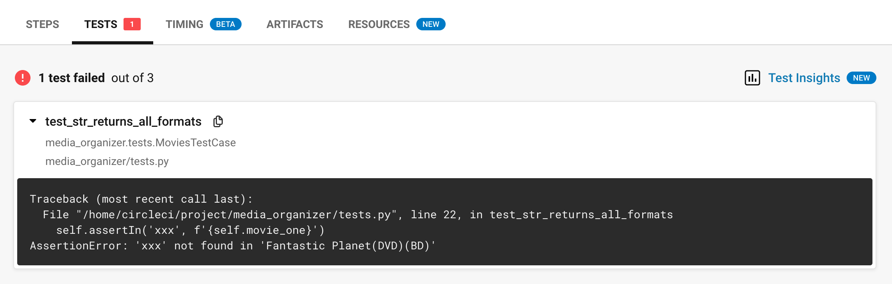

If you're looking for a reliable CI/CD platform to deploy your Python Django project, CircleCi offers a lot. It's easy to set up, comes with tons of reusable set ups called Orbs, and best of all, offers up to 6,000 build minutes per month for free, so it's great for small projects, but can certainly scale to accommodate large enterprise level workflows with paid accounts.

I'm currently working on a project comparing different CI/CD pipelines, trying to get a better idea of what each offers, how they run, and how much it takes to get them set up. My first stop was CircleCi. 

To get familiar with it I spun up a small [sample DJango project](https://github.com/jalletto/circle_ci_python_example) to use for this tutorial. I am an ~~compulsive~~ avid ~~hoarder~~ collector of movies. The idea behind the Django project is an app to help me keep track of all of my blu-rays, DVDs, etc, but really it is just an example project to have something to test and build in CircleCi.

<div class="notice--info">

**Physical Media Inventory Managers**
As I'm sure you've already guessed there are dozens of apps that do this very well already, but I am required by tutorial writers law to choose something that already exists and build a worse version of it. My hands are tied.

If you want a great working version checkout [MovieBuddy](https://apps.apple.com/us/app/moviebuddy-movie-tv-library/id965645508). 

If you want to learn about how to build and test Django with CircleCi, read on.
</div>

## CircleCi: Getting Started

One thing I really liked was that it was easy to sign up and get started with CircleCi since it offers a completely free tier, there's no credit card necessary. Other products I've tried offer a month or two free, but charge after that, so you can't even sign up without a credit card. As part of the signup process you'll be given the option to  follow steps to connect your github or bitbucket account, which you'll need to do to give CircleCi permission to pull your code. I used github for this tutorial.


Once you are signed in click `projects` in the menu on the left. You should see a list of repos from your github account.

## Creating a Project

Select `Setup Project` next to the repository that contains the Django project you want to build. In order to define a pipeline for your project, you'll need to create `.circleci/config.yml` in the root of your repository. You can create this file in the repo yourself, or you can have CircleCi create a template file for you by selecting the option `Commit a starter CI pipeline to a new branch`. 


Either way, after clicking `setup project` you'll be taken to a dashboard similar to the one pictured below. The only difference is that the bottom section where the pipeline runs are list will be blank, since you haven't run any pipelines yet.


For now, take a look at the three drop down menus. The first lets you select pipelines by owner. This is useful if you are working on a team and you want to give permissions for certain pipelines to certain teams. Very helpful if you are looking to get developers to own their own builds. In a new account there will only be two options, everyone, and your user. 

The next drop down lets you select a specific pipeline. For now it will only have the one pipeline we just created.

The most important one to take note of is the last one, which allows you to select pipelines by branch. This will become very useful as we develope.

Now select `circleci-project-setup` from the drop down. This is the branch that CircleCi made when we set up our project and told it to create the config.yml for us.

<div class="notice--info">

**Working With the Config File**

You have a couple of options here. You could pull down the branch CircleCi created and start to edit the file locally, or you can click `Edit Config` in the top right which opens up an editor in your browser. This is nice because CircleCi has a linter built in that will let you know if any of the code in the YML file is invalid.
</div>


If you're updating the code locally you'll need to push every time you make a change, but if you are working in the editor you can click `Save and Run` and CircleCi will push the changes for you.

You should see a template file that looks something like this:

```yml
# Use the latest 2.1 version of CircleCI pipeline process engine.
# See: https://circleci.com/docs/2.0/configuration-reference
version: 2.1

# Define a job to be invoked later in a workflow.
# See: https://circleci.com/docs/2.0/configuration-reference/#jobs
jobs:
  say-hello:
    # Specify the execution environment. You can specify an image from Dockerhub or use one of our Convenience Images from CircleCI's Developer Hub.
    # See: https://circleci.com/docs/2.0/configuration-reference/#docker-machine-macos-windows-executor
    docker:
      - image: cimg/base:stable
    # Add steps to the job
    # See: https://circleci.com/docs/2.0/configuration-reference/#steps
    steps:
      - checkout
      - run:
          name: "Say hello"
          command: "echo Hello, World!"

# Invoke jobs via workflows
# See: https://circleci.com/docs/2.0/configuration-reference/#workflows
workflows:
  say-hello-workflow:
    jobs:
      - say-hello
```
We can start by thinking of the file as containing three pieces. First is the Version of CircleCi we want to use. As of this writing, 2.1 is the latest version. 

After that we have job definitions. [Jobs](https://circleci.com/docs/2.0/jobs-steps/#jobs-overview) are templates for tasks we want to perform. We can define as many jobs as we want and each job can have several steps. It's important to know that jobs do not run just because you define them. You can get a job to run by calling it in a workflow.

[Workflows](https://circleci.com/docs/2.0/workflows/) are where we tell CircleCi which jobs to run and in what order. We can define several workflows that run under different circumstances. For example, we can have a workflow that runs whenever someone pushes a new branch to our repo and a separate workflow that runs only on pushes to a `main` or `production` branch.

In this tutorial we'll define one workflow that runs two jobs. The first job will run our linter and our tests. I'm using [pylint](https://pylint.org/) along with the [pylint-django](https://pypi.org/project/pylint-django/) plugin to make sure my Python code is styled correctly. For tests I'm using the [Unittest module](https://docs.python.org/3/library/unittest.html#module-unittest) that comes built in with Python. Django [recommends using Unittest](https://docs.djangoproject.com/en/4.0/topics/testing/) and is compatible with it out of the box.

Lets start by creating a job called `test-and-lint`. Delete everything in the `config.yml` and replace it with the code below.

```yml
version: 2.1

jobs:
  test-and-lint:
    docker:
      - image: cimg/python:3.10.1
    steps:
      - checkout
      - run:
          name: install dependencies
          command: pip install -r requirements.txt
      - run:
          name: lint
          command: pylint my_media/ media_organizer/
      - run:
          name: run tests
          command: python manage.py test

workflows:
  build-and-test-workflow:
    jobs:
      - build-and-test
```

After we name our job we need to specify an environment for it run in. CircleCi offers MacOS and Linux environments, but most likely you'll want to use a docker image to run your jobs in. CircleCi can pull docker images from Dockerhub, or, in this case, we can use [images provided by circleci](https://circleci.com/docs/2.0/circleci-images/). These are images that CircleCi maintains and that "include tools especially useful for CI/CD". You can search for available images [here](https://circleci.com/developer/images).

Next we define our steps. These are the actual things we want the job to do. The `checkout` step tells CircleCi to checkout the repo code into the step's working directory. 

The `run` command lets us run commands as we would if we were working on the command line. Each `run` command gets a name, which can be anything you want, followed by the actual command we want to run.

In this case we are running three commands. First we need to install our dependencies. In Python we can do this with pip.
Next I run my linter, and the last command runs the tests. Save the changes we have and run the build, it will fail.


No problem. On the view page for the build you'll be able to see the job that failed. Click on it to see a breakdown of each step. You can further click on each step to see the console output. If you click on the `run tests` step your should see an error similar to the one below.


It looks like Django is having trouble connecting to Postgres. This error is occuring when Django tries to set up a test database to run our unit tests. The reason it can't connect is because there is no database, not yet. We'll need to set one up.

When we create a job, we can tell it to use docker and then define an image we want to user. The first image we pass is the main image our job will run in, however we can pass aditional images and CircleCi will create containers we can connect to and use during the job.

In this case we use a Postgres so that Django can set up a test DB. We can pass a number of enviormnet variables, but the miniumu we need for now is to set a `POSTGRES_USER`. When the Postgres container spins up, it will create a postgres role named `example`. This will be the role Django users to connect to the database.

```yml
  test-and-lint:
    docker:
      - image: cimg/python:3.10.1
      - image: cimg/postgres:14.1
        environment:
          POSTGRES_USER: example
```

In order to connect to the test database we'll need to make sure our Django project is set up correctly. Let's take a look at the `settings.py` file in our Django project. In order for our app to be able to connect to Postgres in CircleCi, we'll need to set have `HOST` set to `localhost`. Also, make sure that the `POSTGRES_USER` in your `circleci.yml` matches the `USER` in your `settings.py` file.

```python
DATABASES = {
    'default': {
        'ENGINE': 'django.db.backends.postgresql',
        'NAME': 'my_media',
        'USER': 'example',
        'PASSWORD': '1234',
        'HOST': 'localhost',
        'PORT': '5432',
    }
}
```
Now if we rerun the build it should pass.

## Saving Test Results

CircleCi allows you to save the results of your test runs so you can view them in the UI. This is helpful when debugging and also allows you to take advantage of CircleCi's [test insights](https://circleci.com/docs/2.0/collect-test-data/) feature, which gives you a window into how your tests are performing overall across multiple runs. The data can help you identify things like flaky tests or tests that are taking too long to run.

CircleCi reads the test data from xml files, so in order to take advantage we'll need to make an update to our Django project to tell it to save our test results to an xml file. We can export our Unittest results to `xml` easily by installing the [unittest-xml-reporting](https://pypi.org/project/unittest-xml-reporting/) package with `pip install unittest-xml-reporting`

Next we need to tell Django to use the new package and where to save the test results. We can do that by adding the following to the `settings.py` file.

```python
# XML test runner
TEST_RUNNER = 'xmlrunner.extra.djangotestrunner.XMLTestRunner'
TEST_OUTPUT_DIR = './test_results'
TEST_OUTPUT_FILE_NAME = 'results.xml'
```
NOTE Before you push to github. 
1. Don't forget to add `unittest-xml-reporting` to your requirements.txt file. `pip freeze > requirements.txt`
2. Be sure to add `test_results/` to your `.gitignore` file.

You can tests that everything is running locally by running you tests as you normally would with `python manage.py test`. You should see a `test_results/` directory show up in the root of your project with a `results.xml` file in it.

Now we just need to tell CircleCi where to look for the test results by adding the following to `config.yml`.

```yml
      - run:
          name: run tests
          command: python manage.py test
      - store_test_results:
          path: test_results
```

With these changes in place, rerun the pipeline. Now, under the tests tab in build view you should see your test results. There won't be much output if all you tests pass. But if any fail, you'll be able to see them in the UI. 

Let's go back and add a step to run our linter before our tests.


Green tests are great, but the real benefit of setting this all up is being able to see when tests fail.




## Pushing to Dockerhub
Automatically running our tests with each pull request is great, but what we really want to move toward is deploying our code. If you're using Docker or Kubernetes, you'll want to be able to build an image to deploy later. CircleCi makes that process easy.

I'm using a very simple Dockerfile for this project.

```Docker
FROM python:3
WORKDIR /circle_ci_python_example
COPY . /circle_ci_python_example
RUN pip install -r requirements.txt
COPY . /circle_ci_python_example/
EXPOSE 8000
CMD ["python", "manage.py", "runserver", "0.0.0.0:8000"]
```

In this case we'll build an image and push it to Dockerhub, though it is possible to push to other container management services like AWS ECR. 

First, make sure you have a [Dockerhub account](https://hub.docker.com/) and access to your username and password. You'll also need to create a repository in Dockerhub to store your images.

### Enviorment Variables

In order to push to Dockerhub we'll need to provide a password. Naturally, we don't want to put sensitive information directly into our code, so instead we can use CircleCi's environment variables.

In the upper right corner of the project screen there will be a button with a gear on it that says Project Settings. Clicking this will bring you to a new page with a new menu on the left. Ccick the button for Environment Variables.

From here you should be able to add your Dockerhub user name and password. If you're using the same code as in this tutorial you'll want to name the variables `DOCKERHUB_PASSWORD` and `DOCKERHUB_USERNAME`.

Once set, you can access the environment variables at any step in a job by using `$` followed by the variable name. For example `$DOCKERHUB_PASSWORD`. We'll do just that in the next section.

### Updating Our YML file.

Now that we have a repository on Dockerhub and our password and user name set as envs, we can update our `config.yml` file with a new job to build and push the image ot the remote repository.

CircleCi offers support for running docker commands inside of jobs with the [setup_remote_docker](https://circleci.com/docs/2.0/building-docker-images/)

```yml
build-and-push-to-dockerhub:
    docker:
      - image: cimg/python:3.10.1
    steps:
      - checkout
      - setup_remote_docker:
          version: 19.03.13
          docker_layer_caching: true
      - run: |
          echo "$DOCKERHUB_PASSWORD" | docker login --username $DOCKERHUB_USERNAME --password-stdin
      - run: docker build -t user_name/circle_ci_python_example:$CIRCLE_BRANCH .
      - run: docker push user_name/circle_ci_python_example:$CIRCLE_BRANCH

```
In the code above we create a new job called `build-and-push-to-docker-hub`. The initial setup looks a lot like our `test-and-lint` job. We start with a docker image for python. We don't need Postgres in this step because we won't be running any tests.

Next, we need to checkout the code just like we did in the last job. Next we can add the `setup_remote_docker` step which tells CircleCi to setup a new environment that "is remote, fully-isolated and has been configured to execute Docker commands."

From there we can run our docker commands just as we would from the command line if we were developing locally.

First, we take advantage of the environment variables we set up earlier to login to Dockerhub. The next command builds the docker image and tags it with `user_name/circle_ci_python_example:$CIRCLE_BRANCH`. `$CIRCLE_BRANCH` is a environment vairalbe provided by CircleCi. For this example I used it as a the tag name, but you can obviously tag the image any way you want.

The final command pushes the image to Dockerhub.

Last thing we need to do is add this new job to our workflow.

```yml
workflows:
  build-and-test-workflow:
    jobs:
      - test-and-lint
      - build-and-push-to-dockerhub
```

## Order of Execution

Unless you tell CircleCi otherwise, it will attempt to run the jobs in a workflow in parallel. This comes in handy when you have large workflows or a lot of tests that take a long time to run. You could split your test runs into separate jobs and then CircleCi would run them at the same time for example.

But the way we have our current workflow set up, I don't want to push any builds with failing tests up to Dockerhub, so in this case I don't want to run the jobs in parallel. Instead, I only want to push to Dockerhub after I know all the tests have passed.

I can tell CircleCi to wait by altering the `config.yml` like this.

```yml
workflows:
  build-and-test-workflow:
    jobs:
      - test-and-lint
      - build-and-push-to-dockerhub:
          requires:
            - test-and-lint
```
By adding the `requires` field to `build-and-push-to-dockerhub`, CircleCi now knows that I want it to wait until `test-and-lint` finishes successfully before running `build-and-push-to-dockerhub`. This way if any of the tests fail, the pipeline will fail and I won't risk pushing a broken build to Dockerhub.

## Conclusion
You may need to experiment with different set ups to find what's right for your project. If this project was much larger and I were to refactor what we have so far, I might split the linting step out into a separate job and let it run alongside my tests instead of having them run one after another in the same job.


### Writing Article Checklist

- [x] Write Outline
- [ ] Write Draft
- [ ] Fix Grammarly Errors
- [ ] Read out loud
- [ ] Write 5 or more titles and pick the best on
- [ ] First two paragraphs: What's it about? Why listen to you?
- [ ] Create header image in Canva
- [ ] Optional: Find ways to break up content with quotes or images
- [ ] Verify look of article locally
- [ ] Run mark down linter (`lint`)
- [ ] Add keywords for internal links to front-matter
- [ ] Run `link-opp` and find 1-5 places to incorporate links to other articles
- [ ] Add Earthly `CTA` at bottom ``
- [ ] Raise PR

## Draft.dev Article Checklist

- [ ] Add in Author page
- [ ] Create header image in Canva
- [ ] Optional: Find ways to break up content with quotes or images
- [ ] Verify look of article locally
  - Would any images look better `wide` or without the `figcaption`?
- [ ] Run mark down linter (`lint`)
- [ ] Add keywords for internal links to front-matter
- [ ] Run `link-opp` and find 1-5 places to incorporate links
- [ ] Add Earthly `CTA` at bottom ``
